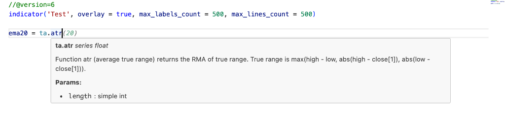
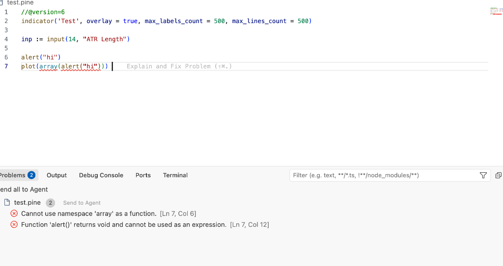
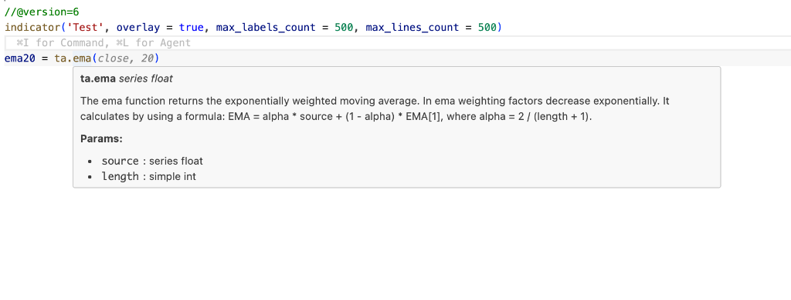

# Pine Script Pro

  

**Pine Script Pro** is a high-performance, professional-grade VS Code extension for TradingView developers. It bridges the gap between script writing and professional software development by providing industrial-strength static analysis, intelligent type Checking, and an ultra-resilient engine optimized for Pine Script v6.

---

## 🚀 Why Pine Script Pro?

Unlike generic syntax highlighters, **Pine Script Pro** understands the execution model of Pine Script. Our custom-built analyzer is designed to handle complex indicators, massive libraries, and the latest v6 syntax with near-zero latency.

### 🛡️ Ultra-Resilient Linter (The "No Noise" Engine)
Never get bogged down by thousands of false positives again.
- **Greedy Symbol Scrapper**: Automatically identifies user-defined functions and variables even if your code has minor indentation or parse errors.
- **Pine v6 Lambda Support**: Full awareness of assigned functions and anonymous lambdas.
- **Smart Whitelisting**: Never flags core keywords like `if`, `else`, or `ta` as undefined, ensuring your error list is clean and actionable.

### 🧠 Intelligent Developer Features
- **Hover Documentation**: Detailed technical reference for every built-in function, including parameter types and return values.
- **Advanced Diagnostics**: Catch `void` return assignment errors, argument count mismatches, and namespace misuses before you even hit "Save" on TradingView.
- **Contextual Autocomplete**: Organized namespaces (`ta.`, `math.`, `array.`) for lightning-fast discovery.

### ⚡ Blazing Performance
- **WASM Powered**: Core parser runs on WebAssembly for sub-millisecond AST generation.
- **Zero-Dependency Core**: Bundled with `esbuild`, keeping the extension lightweight and fast.

---

## 🎨 Professional Visuals

| Feature | Description | Preview |
| :--- | :--- | :--- |
| **Hover Tooltips** | See function signatures and types instantly. |  |
| **Real-time Diagnostics** | Catch logic errors like namespace misuse. |  |
| **Advanced Verification** | Catch void assignments and parameter leaks. |  |

---

## 🛠 Installation

1. Download the latest `pine-script-pro-1.0.0.vsix` file.
2. Open VS Code and press `Cmd+Shift+P` (or `Ctrl+Shift+P`).
3. Type `Extensions: Install from VSIX...` and select the file.
4. Restart VS Code or open a `.pine` file to activate.

## 📜 Requirements
- **VS Code**: 1.75.0 or higher.
- **Language**: Pine Script v6 (optimized), compatible with v3, v4, and v5.

---
---
**License**: Modified MIT. **Mandatory attribution to Revanth Pobala is required** for any code usage. See root [LICENSE.txt](../LICENSE.txt) for details.
